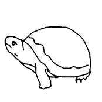

# ECE/CS 508 Spring 2023 Project Team 10

## Project Title
### CUDA Stable Diffusion Algorithm

> [ControlNet repository](https://github.com/lllyasviel/ControlNet)

## Project Summary

Implement the stable diffusion algorithm in CUDA. 
The existing open-source implementations of the diffusion models [[1]](https://arxiv.org/abs/2112.10752 )[[2]](https://arxiv.org/abs/2302.05543)[[3]](https://github.com/CompVis/latent-diffusion)[[4]](https://github.com/lllyasviel/ControlNet) use high level APIs like 
pytorch or tensorflow for implementing diffusion models. Their performance is orders of magnitude off 
from the latency requirements of the real-time applications. Even on the modern desktop class GPUs, 
these models take ~weeks to train and 10s of seconds to generate even relatively low resolution images 
(512x512). [6] has shown that CUDA based implementations of the MLP networks can achieve 
approximately 1OOM improvement in training and inference times compared to their high level 
(tensorflow based) implementations. Moreover, the frame generation latency scales with the resolution 
of the frame, which makes matter even worse for higher resolution images. Hence, it might make sense 
to accelerate the stable diffusion algorithm using GPU programming languages. I propose to implement 
the state of the art stable discussion algorithm [4] in GPU programming languages (cuda or vulkan) 
where “hardware-aware” fusion of certain layers of diffusion models can be performed, which can 
potentially exploit more and more on-chip data reuse for intermediate outputs and avoid more 
expensive off-chip DRAM accesses. 

## How to run
- Currently, this project can only be run using `rai`, a tool from UIUC to run on cloud servers.
```
rai -p .
```
- Input image:
    - 
- Output image:
    - 


## How to configure rai build commands
- Run controlnet with out attentionblock implementation
```yaml
...
commands:
  build:
    - /bin/sh -c 'cd /src/python/ && python3.8 -m pip install ./'
    - /bin/sh -c 'cd /src/ControlNet && python3.8 my_scribble2image.py'
```


## TODO:
1. ~Generate the fake data for running the kernel from the CrossAttention~
1. ~Build unittest for verifying the correctness of the kernel~
1. ~Move the model weights into the docker container and push~
1. ~Integrate pytorch & cuda-c~
    1. ~Find necessary modules from the ControlNet code to make sure what we need to implement~
    1. ~Find out how to connect the C++ code to pytorch~
1. ~Implement the operations in an CrossAttention~
    1. ~Matrix Multiplication~
    1. ~Softmax~
1. Implement the cuda operations in an CrossAttention
    1. ~Matrix Multiplication~
    1. Softmax
1. ~Plug our CrossAttention implementation into the ControlNet model and load weights successfully~
    1. Provide argparse options to switch between the original and our implementation
1. Profiling 
    1. Original CrossAttention (both block and end-to-end)
    1. Our implementation (both block and end-to-end)
1. Potential code optimizations
    1. pointer/ref
    1. `torch.zero_grad()`
1. Decouple the project with rai

## Team Information

|   Info      |        Description     |        Email      |
| ----------- | ---------------------- | ---------------- |
| TeamID      |        Team-10        |
| Member1     |     Cheng-Han Chiang   |  chc11@illinois.edu    |
| Member2     |     Shao-Chian Chen   |  scchen4@illinois.edu |
| Member3     |     Po-Wei Wang    |  poweiww2@illinois.edu  |

## 4/20 meeting status overview
#### where we are in the process
Trying to run [gradio_hough2image.py](https://github.com/lllyasviel/ControlNet/blob/main/gradio_hough2image.py) in [ControlNet](https://github.com/lllyasviel/ControlNet), but we don't have enough gpus to run it.
